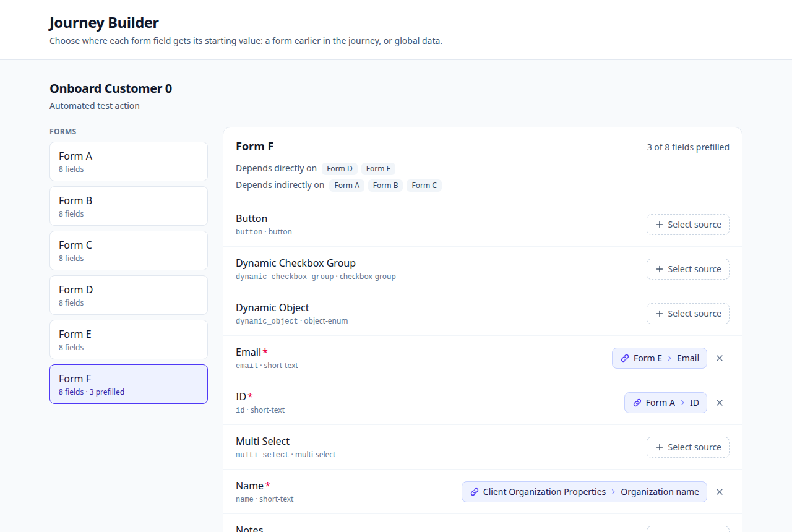
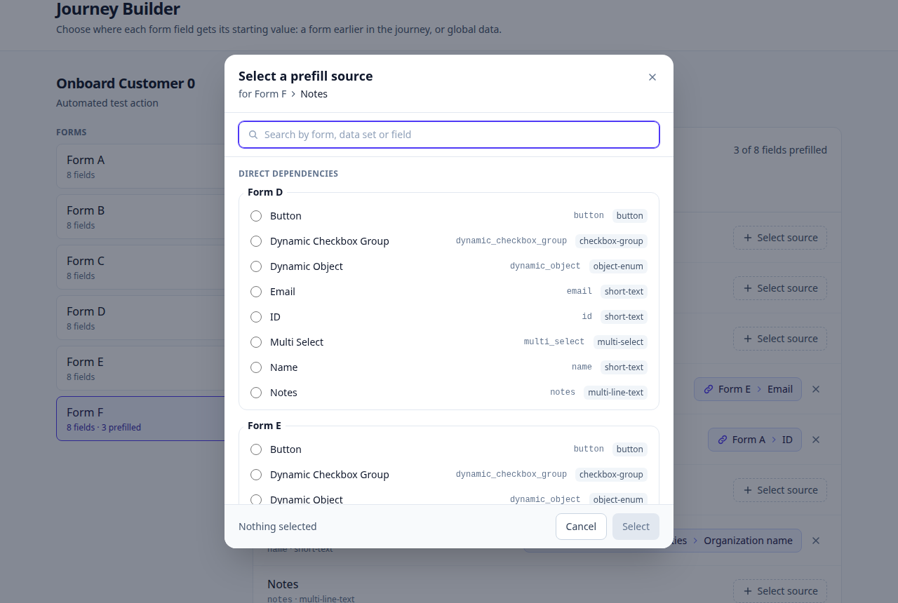
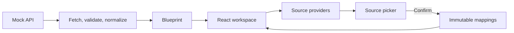

# Journey Builder Prefill Editor

A React and TypeScript solution to the [Avantos Journey Builder challenge](https://app.notion.com/p/Journey-Builder-React-Coding-Challenge-3e7e7901ef2483c5b5b2816a5760119e).
Downstream forms can reuse information from earlier steps: load a blueprint, select a form,
and configure each field's source. This editor changes source references, not submitted values.

|                    Prefill editor                    |                   Source picker                   |
| :--------------------------------------------------: | :-----------------------------------------------: |
|  |  |

[Quick start](#quick-start) · [Behavior](#prefill-behavior) · [Architecture](#architecture) · [Checks](#development-and-checks)

## Quick start

Requires Node.js **22.13+ within 22.x, 24.x, or 26+**, matching `package.json`.

```bash
git clone https://github.com/Reckless98/journey-builder-prefill.git
cd journey-builder-prefill
npm ci

# One-time setup; this nested repository is Git-ignored.
git clone https://github.com/mosaic-avantos/frontendchallengeserver.git frontendchallengeserver

npm run start
```

`npm start` and `npm run start` are equivalent. Run either from the app directory above,
not from `frontendchallengeserver` (where `npm start` runs only the mock).

Keep the terminal running and open **[http://127.0.0.1:5173](http://127.0.0.1:5173)** in your browser;
startup does not open a browser window. The command also starts the official mock API at
**[http://127.0.0.1:3000](http://127.0.0.1:3000)**; the mock has no dependencies to install.

`concurrently` labels the two logs and stops both services on Ctrl+C or when either exits.
Ports 3000 and 5173 must be free. An occupied port fails clearly; Vite uses `--strictPort`.
Run only one instance; use Ctrl+C in its terminal before starting another.
A missing mock checkout produces the clone command above. `npm run start` is a development command.

For separate terminals, run `npm --prefix frontendchallengeserver start` and `npm run dev`.
Those standalone commands retain the official mock's default host and Vite's port fallback.

## Prefill behavior

The picker offers three source categories for the selected form:

- **Direct dependencies:** fields from immediate upstream forms, such as Form B for Form D.
- **Transitive dependencies:** earlier ancestors, such as Form A along `A → B → D`.
- **Global data:** example Action and Client Organization properties available to every form.

Select a field, choose a source, and confirm with **Select** to add or replace its mapping.
The clear button removes that field's mapping. Cancel closes the picker without committing its draft.
Switching forms preserves committed edits and resets the open picker.

Search matches every entered term across group names, field labels, and source keys, ignoring case.
Stored references that are missing, no longer upstream, or excluded by provider configuration show
**Unavailable source** and remain replaceable or clearable. Loading, empty, and API error states
are explicit; failed loads offer retry.

## Architecture



React components own selection, draft, and mapping state. TypeScript defines transport, domain,
and provider contracts; runtime validation checks incoming JSON. Vite serves and builds the app.

- `src/api/`: HTTP client, shape validation, and API-to-domain normalization.
- `src/domain/`: graph traversal, source identities, and immutable mapping updates.
- `src/prefill-sources/`: composable providers, registry, deduplication, and search.
- `src/hooks/` and `src/components/`: request lifecycle, state ownership, and UI.

A `PrefillSource` is `{ type, ownerId, key }`. For `form_field`, `ownerId` is the graph node ID,
not the reusable form definition ID. The triple describes where a value would come from.
See [Architecture & extensibility](docs/ARCHITECTURE.md) for contracts and implementation details.

## Extending sources

A provider returns named groups of options. For a new `src/prefill-sources/currentUser.ts`:

```ts
import type { PrefillSourceProvider } from './types';

export const currentUserProvider: PrefillSourceProvider = {
  id: 'current-user',
  label: 'Current user',
  getGroups: () => [
    {
      id: 'profile',
      label: 'Profile',
      options: [{ source: { type: 'user', ownerId: 'current', key: 'email' }, label: 'Email' }],
    },
  ],
};
```

Register it in `allPrefillProviders` in `src/prefill-sources/registry.ts`. The existing components
render its options without changes. Providers must be pure and synchronous; identities must be stable.

Defaults need no environment file. See [`.env.example`](.env.example) for API settings.
To select/order providers, set `VITE_PREFILL_SOURCES=global-data,direct-dependencies` in `.env.local`.
Unset or blank selects all registered providers; restart Vite after changing configuration.

## Development and checks

```bash
npm run check         # TypeScript, ESLint, Prettier, Vitest, production build
npm test              # Vitest with React Testing Library
npm run test:watch    # Interactive test runner
npm run build         # Production assets in dist/
npm run preview       # Serve the built app; start the mock API separately
```

Tests cover graph shapes, API normalization, mappings, providers, request races, and UI interactions.
[GitHub Actions](.github/workflows/ci.yml) runs `npm ci` and `npm run check` for main pushes and PRs.
Native dialog keyboard/focus behavior was checked separately in Chromium; those browser checks
are outside repository CI.

## Scope and trade-offs

- Edits stay in React memory; reload restores API-provided configuration. The mock serves GET only.
- Global options are illustrative metadata. The app does not fetch source values or execute journeys.
- The adapter imports supported form-field expressions; other expressions produce warnings.
- Field types are display hints. Compatibility filtering and persistence are possible extensions.
- Every matching option is rendered; larger workloads would benefit from virtualization and indexing.
