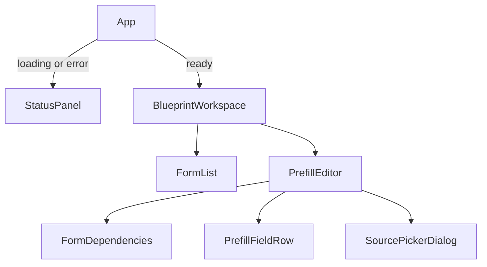

# Architecture & extensibility

Technical reference for the [Journey Builder Prefill Editor](../README.md).
The README covers setup and user behavior; this guide describes the implementation boundaries.

## Responsibilities

| File or area                                       | Responsibility                                                             |
| -------------------------------------------------- | -------------------------------------------------------------------------- |
| `src/main.tsx`, `src/App.tsx`                      | Mount React in StrictMode; select loading, error, or ready UI              |
| `src/api/blueprintClient.ts`                       | Build the graph URL, fetch JSON, and report transport/status errors        |
| `src/api/validateBlueprint.ts`, `src/api/types.ts` | Validate consumed response shapes; describe transport types                |
| `src/api/normalizeBlueprint.ts`                    | Join nodes to definitions and adapt raw data into a Blueprint              |
| `src/domain/types.ts`                              | Forms, fields, source references, dependencies, and mapping contracts      |
| `src/domain/graph.ts`                              | Direct dependency lookup and transitive upstream traversal                 |
| `src/domain/mappings.ts`                           | Stable source identity and immutable mapping updates                       |
| `src/prefill-sources/`                             | Provider contracts, built-ins, registry, composition, indexing, and search |
| `src/hooks/`                                       | Request lifecycle and editable mapping state                               |
| `src/components/`                                  | Navigation, dependency summary, field rows, and source picker              |
| `src/config.ts`, `.env.example`                    | Build-time API and provider configuration                                  |
| `scripts/start-mock.mjs`, `package.json`           | Fixed-port, supervised local development startup                           |
| `vite.config.ts`, `.github/workflows/ci.yml`       | Vite/Vitest configuration and required CI checks                           |

Transport details stay in `src/api/`. The domain contains no React or network code. Providers
project domain data into options; components render those options without branching on source type.
React hooks own lifecycle/state, with pure domain helpers handling graph and mapping operations.

## Fetching and normalization

`useBlueprint` builds the URL with `buildBlueprintGraphUrl` and starts `fetchBlueprintGraph` in an
effect. The default mock request is:

```text
GET http://localhost:3000/api/v1/1/actions/blueprints/bp_01jk766tckfwx84xjcxazggzyc/graph
```

Path identifiers are encoded individually. The client can include the published API's blueprint-version
segment; the mock route omits it, so leave `VITE_BLUEPRINT_VERSION_ID` unset when using the mock.
`fetchBlueprintGraph` rejects failed HTTP statuses, unreadable JSON, or an invalid consumed shape.
`isBlueprintGraphResponse` narrows unknown JSON at runtime; TypeScript alone cannot validate it.
This checks the subset the adapter reads, rather than the complete API or JSON Schema specification.

`normalizeBlueprint` then:

1. Keeps the first node for each node ID, reporting discarded duplicates.
2. Joins each form node's `data.component_id` to a definition in `forms` and retains the node ID.
3. Extracts top-level schema properties, required flags, and type hints. Labels prefer schema title,
   then a matching UI-schema label, then the property key.
4. Resolves top-level UI scopes by decoding the URI fragment once, followed by JSON Pointer
   `~1`/`~0` tokens; percent-encoded and empty property keys work. Nested paths are not resolved.
5. Imports supported `input_mapping` expressions for existing target fields and sorts forms by name.
6. Builds incoming dependencies from edges, including entries for non-form nodes, and returns warnings.

A graph node is an instance of a journey step; a form definition describes reusable fields.
In the mock, six form nodes share three definitions. Selection, source ownership, React editor keys,
and mappings therefore use **node IDs**, never definition IDs.

Unknown edge endpoints are skipped with warnings. Duplicate/self edges are ignored. A missing form
definition leaves a visible form with no fields. Invalid target keys and unsupported expressions
are skipped with warnings; a supported reference to a missing or ineligible source is retained so
the editor can show and repair it. Duplicate definition IDs currently use the last indexed entry.

Supported mappings use `action_component_data` with string `component_key` and `output_key`;
`is_metadata === true` is excluded. The mock starts with no stored mappings. Globals can be chosen
locally, but their API expressions are not imported by this adapter.

### Request lifecycle

`useBlueprint` associates each settled result with a request-key object derived from URL and retry
attempt. A mismatch renders loading immediately, including `A → B → A` navigation. Effect cleanup
aborts its controller; the settle callback also checks that signal before updating state, so late
responses cannot replace the current result. Retry increments the attempt through a functional update.
Loading/error unmounts the workspace; its next mount initializes edits from the received Blueprint.
There is no automatic timeout or response cache.

## DAG traversal

An edge `A → B` means B depends on A. The incoming `DependencyMap` stores `B → [A]`.
Edges drive traversal; a test checks that the supplied mock's `prerequisites` agree with them.
The mock graph has two routes from A to F:

```text
A → B → D → F
A → C → E → F
```

For D, B is direct and A is transitive. For F, D/E are direct and B/C/A are transitive.
`getDirectDependencies` deduplicates existing parents and excludes the selected node. Its cost is
O(d) for d incoming parent entries, including filtering.

`getTransitiveDependencies` performs breadth-first search (BFS):

1. Start a growing queue with the direct parents.
2. Seed a visited set with the selected node and those direct parents.
3. Walk the queue with `for…of`; for each entry, inspect its existing parents.
4. Mark each unseen parent immediately, append it to the result and queue, then continue.

Direct parents stay excluded even if reachable by a longer path. The visited set prevents repeated
ancestors in diamonds and terminates cycles. Non-form intermediate nodes are traversed but offer
no fields. Time is O(Vr + Er), with O(Vr) space, over reachable nodes and edges.
Traversal order is BFS discovery order; providers project results through the name-sorted form list.
Cycles are tolerated, not rejected or diagnosed; upstream/downstream exclusion assumes a valid DAG.

## Source identity and mapping updates

A mapping stores a `PrefillSource` triple, not a submitted email or another evaluated value:

```ts
import type { PrefillSource } from '../domain/types';

const source: PrefillSource = {
  type: 'form_field',
  ownerId: 'form-47c61d17-62b0-4c42-8ca2-0eff641c9d88', // Form A's actual node ID
  key: 'email',
};
```

`sourceId` JSON-serializes `[type, ownerId, key]`, preserving boundaries and escaping even if a part
contains separators. Labels and object identity do not determine identity. Custom providers can
introduce other string types; `form_field` is reserved for graph-backed fields.

`FormPrefill` is a read-only Map from field key to source. `PrefillMappings` is a read-only Map from
form node ID to that inner Map. Read-only types constrain TypeScript callers; they do not freeze objects.

`setMapping` copies the edited form's inner Map and the outer Map, then sets/replaces one field.
Other forms keep their inner Map references. `clearMapping` copies only when a mapping exists,
removes empty form Maps, and returns the original outer reference for a no-op. A real update costs
O(mapped forms + entries in the edited form); it performs no network request.
`usePrefillMappings` uses functional state updates, so queued edits read current state.
Its initial Map is used at mount, not continuously synchronized with later props.

## Components and state ownership



| Owner                         | State or derived responsibility                                        |
| ----------------------------- | ---------------------------------------------------------------------- |
| `App` / `useBlueprint`        | Loading/error/ready outcome and retry lifecycle                        |
| `BlueprintWorkspace`          | Selected form node ID; committed mappings through `usePrefillMappings` |
| `PrefillEditor`               | Open field key; memoized provider sections and source index            |
| `SourcePickerDialog`          | Controlled search query and unconfirmed source draft                   |
| `FormList`, `PrefillFieldRow` | Render selection/counts/resolution and forward edit events             |

The workspace derives the first form as its selection fallback. `key={form.id}` replaces the editor
on form changes, discarding its draft while preserving workspace mappings. A radio change updates
only dialog state. Confirmation checks that the source is currently offered and differs from the
current mapping, then calls the parent setter. Cancel does not call that setter.

The native `<dialog>` uses `showModal()` and closes through its normal close event before parent
unmount. Native radios and fieldsets supply selection semantics; the persistent edit button enables
focus return. Light dismissal uses `closedby="any"` where supported. Search Escape can clear input
before closing in Chromium. Loading uses `role="status"`; errors use `role="alert"` with retry.

## Provider contract and composition

`PrefillSourceProvider` in `src/prefill-sources/types.ts` has a unique `id`, a section `label`, and
`getGroups(context: PrefillContext): PrefillOptionGroup[]`. Context contains the Blueprint and selected
form. Each group has an ID unique within its provider, a label, and options containing `source`,
`label`, and optional `valueType`. The method must be pure and synchronous because it runs during render.

Built-ins are `directDependenciesProvider`, `transitiveDependenciesProvider`, and `globalDataProvider`.
The first two project upstream form fields; `createGlobalDataProvider` captures static data-set
metadata and offers it to any form. It performs no fetching.

`allPrefillProviders` registers defaults. `selectPrefillProviders` selects unique IDs in configured
order. Unset/blank `VITE_PREFILL_SOURCES` selects all; comma-only produces an empty selection.
Unknown IDs are skipped and reported by configuration diagnostics. Changes require a Vite restart.

`buildSections` composes well-formed provider outputs in order:

- Reserved `form_field` references must identify an existing field of an upstream form. For DAG input,
  this rejects self, downstream, missing-owner, and missing-field offers, including from custom providers.
- Complete source identities are deduplicated across providers; the first valid offer wins.
- Empty groups are removed; empty sections remain so the dialog can explain unavailable categories.

`indexOptions` resolves stored source IDs to their option/group labels. A missing entry marks a mapping
unavailable, including when a provider is disabled. `filterSections` requires every case-insensitive
query term to match group label, option label, or source key. Search visibility does not determine
validity: a selected draft hidden by search can still be confirmed against the full index.
`valueType` is a display hint, not compatibility enforcement. Provider outputs are trusted typed data;
malformed or throwing custom providers are not runtime-sandboxed.

## Adding another provider

### 1. Implement the interface

Create the new file `src/prefill-sources/currentUser.ts`:

```ts
import type { PrefillSourceProvider } from './types';

export const currentUserProvider: PrefillSourceProvider = {
  id: 'current-user',
  label: 'Current user',
  getGroups: () => [
    {
      id: 'profile',
      label: 'Profile',
      options: [{ source: { type: 'user', ownerId: 'current', key: 'email' }, label: 'Email' }],
    },
  ],
};
```

This example offers a profile-email reference; it does not authenticate or fetch a user.
Keep the source triple stable. For actual external metadata, load it before constructing a synchronous
provider, or design an asynchronous provider contract and loading/error UI as a separate extension.

### 2. Register it

In `src/prefill-sources/registry.ts`, add its import and append it to the existing array:

```ts
import { currentUserProvider } from './currentUser';

export const allPrefillProviders: readonly PrefillSourceProvider[] = [
  directDependenciesProvider,
  transitiveDependenciesProvider,
  globalDataProvider,
  currentUserProvider,
];
```

Keep the existing registry imports and selection functions. Components already consume generic
sections/groups/options, so registration needs no React changes.

### 3. Configure and verify

Leave configuration unset to include it, or select a subset in `.env.local`:

```dotenv
VITE_PREFILL_SOURCES=global-data,current-user
```

Restart Vite. Test the provider's groups/identities, composition deduplication, and any form-field
validity rules. An App integration test can inject a `providers` prop to check picker selection and
row resolution. Run `npm run check`; verify a chosen source can be replaced and cleared.

## Testing strategy

Vitest runs domain/API/provider unit tests and React Testing Library integration tests in jsdom.
The fixture in `src/test/fixtures/mock-server-graph.json` is a copy of the official mock response;
tests normalize it through the real adapter. Fetch is stubbed; test setup provides partial dialog
open/close/focus stand-ins. Tests cover branches/diamonds/cycles/missing nodes, mapping immutability,
URL/status/body validation, pointer decoding, provider combinations, stale sources, request races,
and rendered add/replace/clear/cancel flows.

jsdom cannot establish native modal focus trapping, Escape, or outside dismissal. Separate Chromium
checks exercised those behaviors; they are not committed runners or part of repository CI. Firefox,
WebKit, real devices, and screen-reader output remain unverified.

`npm run check` chains TypeScript, ESLint, Prettier, Vitest, and production build. CI uses Node 22,
`npm ci`, and that same command on main pushes and pull requests; a formatting failure stops the chain.

## Limitations and extension points

- Edits are in memory. Persistence would need serialization back to API expressions and a write flow;
  the official mock serves GET only. The editor does not execute a journey or retrieve submitted values.
- Only the documented form-field expression subset is imported. Global options are illustrative metadata.
- Type compatibility is not enforced; add a policy at composition/selection if the product requires it.
- The picker renders all matching options, and search scans options for every query term. Virtualization
  and indexing are possible scaling extensions. Sections are memoized while their input references hold;
  composition and the dependency summary still perform separate traversals.
- Normalization deduplicates edges with per-parent array scans and extracts fields per form node,
  including shared definitions. Sets and shared-definition caching could reduce repeated work.
- Cycles are not diagnosed, nested UI metadata recurses without a depth limit, and there is no fetch timeout.
  Structural validation is deliberately narrower than the full published API contract.
